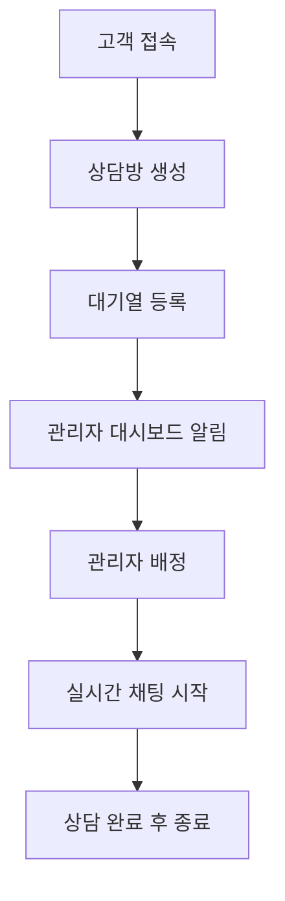

# 🦷 치과 병원 실시간 채팅 시스템

실시간 WebSocket 기반 치과 병원 고객 상담 채팅 시스템입니다. 고객과 상담사 간의 1:1 실시간 채팅과 대기열 관리 기능을 제공합니다.

## 📋 프로젝트 개요

이 프로젝트는 치과 병원에서 고객과 상담사(관리자) 간의 실시간 상담을 위한 웹 기반 채팅 시스템입니다. 고객의 상담 요청을 자동으로 대기열에 관리하고, 상담사에게 효율적으로 배정하는 기능을 제공합니다.

### 핵심 목적
- 치과 병원 고객의 실시간 상담 지원
- 상담사-고객 간의 효율적인 매칭 시스템
- 대기열 관리를 통한 체계적인 상담 서비스 제공

## ✨ 주요 기능

### 🔄 실시간 1:1 채팅
- WebSocket(STOMP) 기반 실시간 메시징
- 고객과 상담사 간의 즉시 메시지 전송/수신
- 메시지 타임스탬프 및 발신자 표시
- 연결 상태 실시간 모니터링

### 👥 자동 매칭 시스템  
- 고객 요청 시 자동 대기열 등록
- 사용 가능한 상담사에게 자동 매칭
- 상담사별 동시 상담 가능 건수 관리
- 대기 시간 실시간 표시

### 🎛️ 관리자 대시보드
- 대기 중인 고객 목록 실시간 모니터링
- 수동 고객-상담사 배정 기능
- 활성 채팅방 관리 및 종료 기능
- 자동 새로고침 및 알림 시스템

## 🛠️ 기술 스택

### Backend
- **Framework**: Spring Boot 3.5.4
- **Java Version**: Java 21 (Virtual Threads 지원)
- **Build Tool**: Maven
- **WebSocket**: STOMP over WebSocket
- **Database**: H2 Database (In-memory)
- **ORM**: Spring Data JPA + Hibernate
- **Security**: Spring Security
- **Template Engine**: Thymeleaf

### Frontend
- **HTML5/CSS3**: 반응형 웹 디자인
- **JavaScript**: ES6+, WebSocket 클라이언트
- **UI Libraries**: SockJS, STOMP.js
- **Styling**: Custom CSS with Gradient Design

### 핵심 의존성
```xml
- spring-boot-starter-websocket
- spring-boot-starter-data-jpa  
- spring-boot-starter-security
- spring-boot-starter-thymeleaf
- h2database
- sockjs-client & stomp-websocket
```

## 📁 프로젝트 구조

```
dentalchat/
├── src/
│   ├── main/
│   │   ├── java/com/ezlevup/dentalchat/
│   │   │   ├── DentalchatApplication.java          # 메인 애플리케이션
│   │   │   ├── config/                             # 설정 클래스
│   │   │   │   ├── SecurityConfig.java             # 보안 설정
│   │   │   │   ├── WebSocketConfig.java            # WebSocket 설정
│   │   │   │   └── WebSocketSecurityConfig.java    # WebSocket 보안
│   │   │   ├── controller/                         # 컨트롤러
│   │   │   │   ├── ChatController.java             # 채팅 메시지 처리
│   │   │   │   ├── AdminController.java            # 관리자 기능
│   │   │   │   ├── AuthController.java             # 인증 처리
│   │   │   │   └── HomeController.java             # 메인 페이지
│   │   │   ├── dto/                                # 데이터 전송 객체
│   │   │   │   ├── ChatMessage.java                # 채팅 메시지 DTO
│   │   │   │   ├── ChatRoomDto.java               # 채팅방 DTO
│   │   │   │   ├── MessageType.java               # 메시지 타입 열거형
│   │   │   │   └── UserRole.java                  # 사용자 역할 열거형
│   │   │   ├── entity/                            # JPA 엔티티
│   │   │   │   ├── User.java                      # 사용자 엔티티
│   │   │   │   ├── ChatRoom.java                  # 채팅방 엔티티
│   │   │   │   ├── ChatSession.java               # 채팅 세션 엔티티
│   │   │   │   └── Message.java                   # 메시지 엔티티
│   │   │   ├── repository/                        # 데이터 접근 계층
│   │   │   │   ├── UserRepository.java            # 사용자 레포지토리
│   │   │   │   ├── ChatRoomRepository.java        # 채팅방 레포지토리
│   │   │   │   └── MessageRepository.java         # 메시지 레포지토리
│   │   │   └── service/                           # 비즈니스 로직
│   │   │       ├── UserService.java               # 사용자 서비스
│   │   │       ├── ChatRoomService.java           # 채팅방 관리 서비스
│   │   │       └── MessageService.java            # 메시지 서비스
│   │   └── resources/
│   │       ├── application.yml                    # 애플리케이션 설정
│   │       ├── static/js/
│   │       │   └── app.js                         # 클라이언트 WebSocket 로직
│   │       └── templates/                         # Thymeleaf 템플릿
│   │           ├── chat.html                      # 채팅 페이지
│   │           ├── login.html                     # 로그인 페이지
│   │           └── admin/
│   │               └── dashboard.html             # 관리자 대시보드
│   └── test/
│       └── java/com/ezlevup/dentalchat/          # 테스트 코드
│           ├── DentalchatApplicationTests.java    # 기본 애플리케이션 테스트
│           ├── SimpleIntegrationTest.java         # 통합 테스트
│           └── service/
│               └── ChatRoomServiceUnitTest.java   # 서비스 단위 테스트
├── CLAUDE.md                                      # 프로젝트 가이드
├── pom.xml                                        # Maven 설정
└── README.md                                      # 프로젝트 문서
```

## 🚀 로컬 환경 설치 및 실행

### 사전 요구사항
- **Java 21** 이상
- **Maven 3.6** 이상

### 설치 단계

1. **저장소 클론**
```bash
git clone <repository-url>
cd dentalchat
```

2. **의존성 설치 및 컴파일**
```bash
./mvnw clean compile
```

3. **애플리케이션 실행**
```bash
./mvnw spring-boot:run
```

4. **브라우저에서 접속**
```
http://localhost:8080
```

### 추가 명령어
```bash
# 테스트 실행
./mvnw test

# JAR 패키징
./mvnw clean package

# 특정 테스트 실행
./mvnw test -Dtest=ChatRoomServiceUnitTest

# H2 데이터베이스 콘솔 접속
http://localhost:8080/h2-console
```

## 📖 기본 사용 방법

### 고객 사용법

1. **채팅 페이지 접속**: `http://localhost:8080`
2. **정보 입력**: 이름 입력, "고객" 역할 선택
3. **상담방 입장**: 상담방 ID 입력 후 "입장" 클릭
4. **실시간 채팅**: 메시지 입력하여 상담사와 대화

### 관리자(상담사) 사용법

1. **대시보드 접속**: `http://localhost:8080/admin/dashboard`
2. **관리자 설정**: 관리자 이름 입력 및 설정
3. **고객 배정**: 
   - 대기 중인 고객 목록에서 "배정하기" 클릭
   - 또는 "다음 고객 자동 배정" 클릭
4. **채팅 진행**: "채팅방 열기"를 통해 고객과 대화
5. **상담 종료**: "종료하기" 버튼으로 상담 마무리

### 핵심 기능 흐름



## 📸 스크린샷

### 메인 채팅 화면

*고객과 상담사 간의 실시간 채팅 인터페이스*

### 관리자 대시보드  

*대기 고객 관리 및 활성 채팅방 모니터링 화면*

### 반응형 모바일 화면

*모바일 디바이스 최적화된 반응형 UI*

---

## 🔧 개발 환경 설정

### IDE 설정 권장사항
- **IntelliJ IDEA** 또는 **Eclipse** with Spring Tools
- **Java 21** JDK 설정
- **Maven** 플러그인 활성화
- **Lombok** 플러그인 설치 (필요시)

### 디버깅 및 모니터링
- H2 콘솔: `http://localhost:8080/h2-console`
- 애플리케이션 로그: DEBUG 레벨에서 상세 WebSocket 로깅
- Spring Boot Actuator 엔드포인트: `/actuator/health`, `/actuator/info`

---

**개발자**: EzLevUp Team  
**라이선스**: MIT License  
**버전**: 0.0.1-SNAPSHOT

> 🚀 **바로 실행해보세요!** 위 가이드를 따라 `./mvnw spring-boot:run` 명령어로 즉시 실행할 수 있습니다.